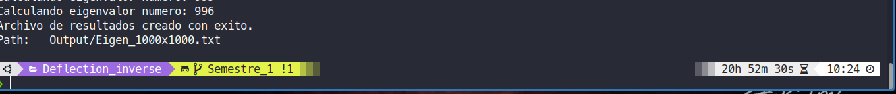

# Tarea 10 - Métodos numéricos

## Organizacion de carpetas y archivos

```bash
├── Data
│  ├── Eigen_3x3.txt
│  ├── Eigen_50x50.txt
│  ├── Eigen_125x125.txt
│  ├── Eigen_500x500.txt
│  ├── Eigen_1000x1000.txt
│  └── matrix.txt
├── Deflection_inverse
│  ├── main.c
│  ├── Makefile
│  └── Output
│     ├── Eigen_3x3.txt
│     ├── Eigen_50x50.txt
│     ├── Eigen_125x125.txt
│     ├── Eigen_500x500.txt
│     ├── Eigen_1000x1000.txt
│     └── matrix.txt
├── Functions
│  ├── solvers.c
│  ├── solvers.h
│  ├── tools.c
│  └── tools.h
└── Jacobi_method
   ├── main.c
   ├── Makefile
   └── Output
      ├── Eigen_3x3.txt
      ├── Eigen_50x50.txt
      ├── Eigen_125x125.txt
      ├── Eigen_500x500.txt
      ├── Eigen_500x500.txt
      └── matrix.txt

```

## Compilación

Cada método realizado en las carpetas `deflection_inverse` y `Jacobi_method` contiene un documento `Makefile`. El archivo `Makefile` contiene las flags y archivos necesarios para la compilación de los programas.

## Ejecución

Para la ejecucción de los programas se realiza con el siguiente comando:

```bash
./main.out $nombre_del_archivo
```

donde `nombre_del_archivo` debe ser el nombre de algún archivo contenido en la carpeta `Data`. Por ejemplo, si se quiere realizar la ejecución con el archivo `Eigen_3x3.txt`, el comando deberia ser el siguiente:

```bash
./main.out Eigen_3x3.txt
```

## Resultados

Los resultados de los programas son guardados en la carpeta `Output` con el mismo nombre que el archivo que contenia a la matriz. La carpeta `Output` se encuentra de forma independiente para cada método realizado.

## Recomendaciones

El método de la potencia inversa con deflación le tomo un tiempo de 20h 52min 30s en resolver la matriz contenida en el archivo `Eigen_1000x1000.txt`. Si se quiere realizar este calculo nuevamente tome en cuenta este resultado.


